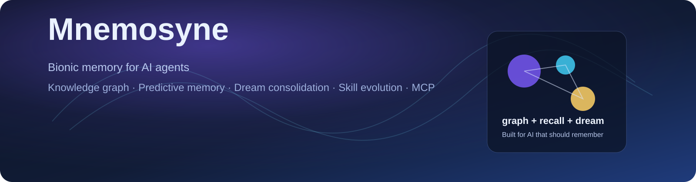
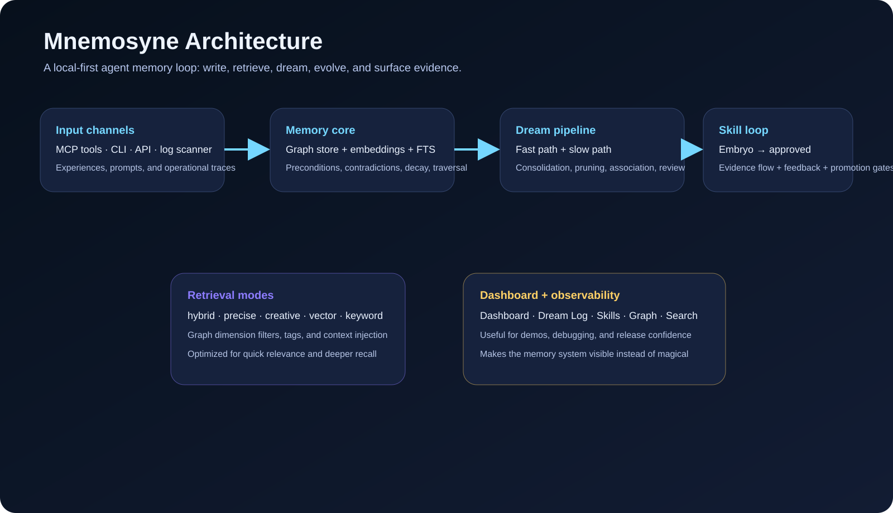

<div align="center">

# Mnemosyne

**Give your AI a brain that remembers across sessions, retrieves with GraphRAG, predicts with `precondition`, dreams to consolidate, and grows governed skills.**

Bionic Experience & Memory System — Agent memory, GraphRAG, vector search, predictive memory, dream consolidation, Skill Memory, MCP, REST API, and dashboard.

[](https://www.python.org/)
[](LICENSE)
[](https://modelcontextprotocol.io/)
[](CHANGELOG.md)
[](https://github.com/nianpangzhi233/Mnemosyne-AI-Memory/actions/workflows/ci.yml)
[](https://github.com/nianpangzhi233/Mnemosyne-AI-Memory/actions/workflows/pages.yml)
[](#knowledge-graph--multi-dimensional-retrieval)
[](#predictive-memory)

[中文文档](docs/README_CN.md) · [Project Site](https://nianpangzhi233.github.io/Mnemosyne-AI-Memory/) · [FAQ](docs/faq.md) · [Benchmarks](docs/benchmarks.md) · [Why it matters](docs/why-it-matters.md) · [Releases](https://github.com/nianpangzhi233/Mnemosyne-AI-Memory/releases)

</div>

<p align="center">
  
</p>

<p align="center">
  <strong>For AI agents that should remember what matters, dream what connects, and grow skills that survive the next session.</strong>
</p>

<p align="center">
  <a href="https://nianpangzhi233.github.io/Mnemosyne-AI-Memory/">Live demo / project page</a> ·
  <a href="#quick-start">Quick start</a> ·
  <a href="#skill-memory-system">Skill evolution</a>
</p>

---

## What It Is

Mnemosyne is a local-first AI memory system for developers who keep teaching an agent the same lesson and want it to actually remember. It combines GraphRAG, vector search, predictive memory, dream consolidation, and governed Skill Memory behind MCP, REST API, CLI, and a dashboard.

## The Problem

AI assistants have a fatal flaw: **they can't remember.**

You spent 30 minutes explaining your project architecture — next day, it's gone. You corrected it 3 times to use `const` instead of `var` — 4th time, still writing `var`. You said "I prefer concise replies" — next session, it's writing essays again.

This isn't a bug, it's by design — every conversation starts from a blank slate.

**Mnemosyne fixes this.** Not a file store, not a diary, not keyword matching. It's a **living knowledge graph** — like a human brain that associates, forgets, and dreams.

### Use Cases

- Remember team preferences, architecture decisions, and recurring fixes.
- Recall project-specific lessons without re-explaining them every session.
- Surface known pitfalls before the agent repeats them.
- Convert reliable experience clusters into reusable, governed skills.

### Why it is different

- Memory is not append-only. It can verify, contradict, decay, and evolve.
- Retrieval is not one-dimensional. It combines vector search, keyword search, graph traversal, and tag filtering.
- Skills are not just prompts. They are tested, governed artifacts with evidence, feedback, and promotion rules.
- It ships with a dashboard, REST API, MCP server, and a one-command installer.

### Visual overview

<p align="center">
  
</p>

<p align="center">
  
</p>

---

## Quick Start

```bash
git clone https://github.com/nianpangzhi233/Mnemosyne-AI-Memory.git
cd Mnemosyne-AI-Memory
python setup.py
```

Start the full stack in three shells:

```bash
python scripts/api/start_api.py --port 8979
streamlit run scripts/dashboard/app.py --server.port 8501
python scripts/graph_dream.py --full
```

If you only want the main flow, run `python setup.py` first and then use `graph_write.py`, `graph_query.py`, and `graph_dream.py`.

```python
# Write an experience
memory_write(content="Gzip request body must be decompressed before JSON.parse()",
             principle="Always check Content-Encoding header before parsing")

# Search memories
memory_search(query="request body parse failure", layer="L0")
# → Returns: "Always check Content-Encoding header" (~100 tokens only)

# Auto-inject relevant memories on startup (memories find you)
memory_inject(context="API proxy project")

# Predictive memory: remember when an experience applies
memory_write(
    content="torch 2.11.0 crashes on this Windows setup; use torch 2.6.0 instead",
    precondition="installing torch on Windows",
    predicted_outcome="torch 2.6.0 is the stable choice"
)
```

---

## Core Features

### Three-Layer Memory (L0/L1/L2)

Inspired by ByteDance's OpenViking. Don't dump 50K tokens of context into every prompt:

| Layer | Size | Purpose |
|-------|------|---------|
| **L0** Abstract | ~100 tokens | Quick relevance check, injected at startup |
| **L1** Overview | ~500 tokens | Enough for most queries |
| **L2** Full Content | Unlimited | When you actually need the details |

Result: **83% token cost reduction** with no loss in retrieval quality.

### Knowledge Graph + Multi-Dimensional Retrieval

Memories are connected by relation types, then routed through orthogonal graph dimensions (`semantic`, `causal`, `temporal`, `entity`) for more precise retrieval:

| Relation | Meaning | Example |
|----------|---------|---------|
| `is_a` | Categorize into abstract principle | "gzip decompress fail" → is_a → "check encoding first" |
| `similar_to` | Semantically similar (vector ≥ 0.85) | "response garbled" ≈ "JSON parse error" |
| `caused` | Causal chain | "no input validation" → caused → "production 500" |
| `solves` | Solution link | "added retry logic" → solves → "API timeout" |
| `contradicts` | New experience overrides old | "use approach A" ✗ "actually use B" |
| `transfers_to` | Cross-domain transfer | "Node.js error handling" → transfers to → "Python project" |
| `evolved_from` | Strategy distilled from cluster | Abstract strategy from multiple experiences |

v6.1 adds SYNAPSE-style spreading activation with 5 search modes:

| Mode | Use case |
|------|----------|
| `hybrid` | Default vector + keyword + graph retrieval |
| `precise` | Conservative traversal through strong edges |
| `creative` | Wider association through weak edges and `is_a` concept jumps |
| `vector` | Pure semantic similarity search |
| `keyword` | FTS5 keyword search |

### Predictive Memory

Mnemosyne is no longer append-only. Experiences can declare:

| Field | Meaning |
|-------|---------|
| `precondition` | When this memory applies |
| `predicted_outcome` | What should happen under that condition |
| `confidence` | Reliability score, increased by verification and reduced by contradiction |

When a new memory matches an old precondition, Mnemosyne validates the old prediction automatically. Confirming evidence strengthens the memory; conflicting evidence creates a `contradicts` edge and lowers stale confidence.

### Dream (Automatic Consolidation)

The human brain consolidates memories during sleep. Mnemosyne does the same with a Fast/Slow dream pipeline:

| Stream | Purpose |
|--------|---------|
| Fast Path | Deterministic maintenance: decay, sync, incremental association, index-safe cleanup |
| Slow Path | Deeper consolidation: contradiction discovery, causal links, strategy distillation, optional LLM review |

v6.1 optimizes Dream around a three-layer biomimetic architecture:

| Layer | Mnemosyne component |
|-------|--------------------|
| Hippocampus | Write-time predictive validation and auto-association |
| REM sleep | Incremental `similar_to` and `contradicts` discovery |
| Prefrontal cortex | Optional LLM-assisted contradiction judgment and review |

Runs automatically at 3 AM, noon, and 5 PM daily. Or trigger manually:

```bash
python scripts/graph_dream.py --full
```

The background skill daemon extends this with a post-dream skill loop:

- scan new `embryo` and `needs_revision` skills after each full dream run
- run up to 2 bilateral evolution rounds per candidate
- record trial feedback automatically
- auto-promote only low-risk skills after 3 consecutive successful trials
- keep medium/high-risk skills in a pending-approval state

```bash
skill-daemon.cmd
```

### Skill Memory System

v7.1 lets mature experience clusters grow into reusable, governed skills through bilateral evolution:

```text
experience cluster -> embryo -> draft -> tested -> evolved -> approved -> injected skill
```

Key rules:

| State | Meaning | Default injection |
|-------|---------|-------------------|
| `embryo` | Graph-discovered skill candidate | No |
| `draft` | LLM-developed operational draft | No |
| `tested` | Baseline and with-skill runs recorded with judge output | No |
| `evolved` | Darwin live tests improved behavior and Mnemosyne graph governance passed | No, except explicit trial/experimental modes |
| `approved` | Verified skill allowed in normal context | Yes |
| `deprecated` | Soft-retired skill with evidence preserved | No |

Dry-run scoring cannot produce `evolved`. Approval is gated: a skill must have passing bilateral evidence, a synced `SKILL.md` hash, and at least one `verified_by` edge before it can become `approved`.

Bilateral evolution means:

```text
Darwin side: baseline vs with-skill live tests prove behavior improved.
Mnemosyne side: graph evidence, feedback, trigger precision, and safety prove the skill is trustworthy.
```

Generated skill mirrors live in:

```text
skills/<slug>/SKILL.md
```

Skill test prompts live beside the skill:

```text
skills/<slug>/test-prompts.json
```

### Automatic Conversation Learning

Scans opencode conversation logs, filters noise (chitchat, boilerplate, system warnings), and uses LLM to distill principles and summaries from valuable fragments — writing them into the memory graph.

You use AI normally, memories accumulate automatically. No manual recording needed.

### Privacy Guard

All auto-discovered relations go through a safety audit. Edges involving passwords, keys, ID numbers, or other sensitive information are automatically rejected.

---

## Integration

### MCP (Recommended)

Any AI tool that supports MCP (Model Context Protocol) can use Mnemosyne:

```json
{
  "mcpServers": {
    "mnemosyne": {
      "command": "python",
      "args": ["scripts/mcp_server/start_mcp.py"]
    }
  }
}
```

Core memory tools: `memory_write`, `memory_search`, `memory_inject`, `memory_detail`, `memory_update`, `memory_delete`.

Skill Memory tools: `memory_crystallize`, `memory_skill_search`, `memory_skill_inject`, `memory_skill_approve`, `memory_skill_feedback`, `memory_skill_deprecate`.

`memory_search` supports `hybrid`, `precise`, `creative`, `vector`, and `keyword` modes, plus graph dimension and tag filters.

### REST API

```bash
python scripts/api/start_api.py --port 8979
# Swagger docs: http://localhost:8979/docs

curl http://localhost:8979/api/health
# → {"status":"ok","nodes":0,"edges":0}

curl "http://localhost:8979/api/search?q=gzip&layer=L0&top=5"
```

### CLI

```bash
# Write
python scripts/graph_write.py --content "experience content" --principle "abstract principle"

# Search (semantic / keyword / hybrid)
python scripts/graph_query.py --vector-search "keyword" --layer L0 --top 5

# Health check
python scripts/graph_audit.py

# Evaluate a skill with an OpenAI-compatible runner/judge
python scripts/evaluate_skill.py \
  --skill-id <skill-node-id> \
  --config configs/skill-eval.local-gateway.example.json

# Run the skill evidence-flow daemon
skill-daemon.cmd
```

`evaluate_skill.py` is a thin adapter. The reusable flow lives in `core.skill_evolution.SkillEvolutionRunner`, and provider-specific execution lives in `core.runners`. Do not put real API keys in example configs; use environment variables such as `MNEMOSYNE_LLM_API_KEY` for private endpoints.

---

## Dashboard

```bash
streamlit run scripts/dashboard/app.py --server.port 8501
```

| Page | Features |
|------|----------|
| Dashboard | Control console, quick search, health metrics, recent writes, audit signals |
| Skills | Skill catalog, evidence flow, injection status, audit flags |
| Search | Search + L0→L1→L2 progressive expand |
| Graph | D3.js force-directed graph (zoom, drag, type coloring) |
| Dream Log | Fast/Slow dream runs, phase timing, click to expand details |

---

## Project Structure

```
scripts/
├── core/                # Abstraction layer (swappable components)
│   ├── graph_store.py   # Graph store interface
│   ├── sqlite_store.py  # SQLite impl (vectors + FTS5 + graph traversal)
│   ├── embedder.py      # Embedding interface (Harrier/BGE-M3/Qwen)
│   └── dream_pipeline.py # Fast/Slow dream pipeline
├── api/                 # FastAPI REST API + Swagger
├── mcp_server/          # MCP Server (memory + skill tools, stdio)
├── dashboard/           # Streamlit visualization dashboard
├── log_scanner/         # Conversation log scanner + filter + distill
├── graph_write.py       # Write CLI
├── graph_query.py       # Query CLI
├── graph_dream.py       # Dream CLI
└── graph_audit.py       # Health report + cleanup
```

Every component is swappable through abstract interfaces:
- **Storage** (GraphStore) → SQLite / FAISS / Neo4j
- **Embedding** (Embedder) → Harrier / BGE-M3 / Qwen
- **Scheduler** (TaskRunner) → APScheduler / Celery

---

## Design Philosophy

Mnemosyne simulates three memory mechanisms of the human brain:

**Prediction** — You enter the same situation again, and the brain expects what should happen. Predictive memory does this with `precondition` + `predicted_outcome`.

**Intuition** — Walk into a kitchen, automatically think "food." The environment triggers memory. Startup injection does exactly this.

**Recall** — Someone asks "how did we make that dish?" and you actively search your memory. Vector search + graph traversal finds experiences and discovers deeper connections along relation edges.

**Dream** — During sleep, the brain replays events, consolidates connections, and prunes unused memories. The dream pipeline does the same thing — automatically.

| Human Brain | Mnemosyne |
|-------------|-----------|
| Hippocampus fast encoding | `memory_write` instant write |
| Predictive coding | `precondition` + `predicted_outcome` validation |
| Neocortex slow consolidation | `graph_dream` Fast/Slow dream pipeline |
| Retrieval-triggered reconsolidation | Auto touch + decay update on search |
| REM sleep abstraction | Optional 3-round LLM review |
| Synaptic pruning | Decay scoring + cold archival |
| Forgetting curve | `base_score × e^(-0.03 × days) × log₂(access+2)` |

---

## Configuration

### LLM Review (Optional)

Runs on pure rules by default — no LLM needed. For smarter review, copy `llm_config.example.json` to `llm_config.json` and fill in your own key:

```json
{
  "enabled": true,
  "endpoint": "https://api.deepseek.com/chat/completions",
  "model": "deepseek-v4-flash",
  "api_key": "your-key"
}
```

### Embedding Models

| Model | Dimensions | Load Speed | Quality | License |
|-------|-----------|------------|---------|---------|
| [Harrier 0.6b](https://huggingface.co/microsoft/harrier-oss-v1-0.6b) (default) | 1024 | **1.2s** | MTEB #1 (2026) | MIT |
| BGE-M3 | 1024 | 11s | Strong | MIT |
| Qwen3-Embedding | 1024 | Medium | Strong | Apache 2.0 |

---

## Requirements

- Python 3.10+
- ~2GB disk space (embedding model)
- Optional: `faiss-cpu` for faster vector search; numpy fallback is built in
- Fully local, no external services required

## How Mnemosyne Compares

| Capability | Plain prompt memory | Vector DB / RAG | Mnemosyne |
|------------|---------------------|-----------------|-----------|
| Remembers across sessions | Manual | Yes | Yes |
| Knows when a memory applies | No | Usually no | `precondition` + predictive validation |
| Handles contradictions | No | Usually manual | `contradicts` edges + confidence decay |
| Consolidates automatically | No | No | Fast/Slow dream pipeline |
| Grows reusable agent skills | No | No | Governed Skill Memory flow |
| Agent integration | Copy/paste | App-specific | MCP + REST + CLI |

## Community

- [Roadmap](ROADMAP.md)
- [Contributing](CONTRIBUTING.md)
- [Security Policy](SECURITY.md)
- [Open Source Launch Checklist](docs/open-source-launch.md)
- [FAQ](docs/faq.md)
- [Benchmarks](docs/benchmarks.md)
- [Why it matters](docs/why-it-matters.md)

## License

[MIT](LICENSE)

## Acknowledgments

Neuroscience foundations:
- **CLS** (Complementary Learning Systems) — fast/slow dual memory
- **Reconsolidation** — re-encoding during retrieval
- **NREM + REM** — two-stage memory consolidation
- **Ebbinghaus Forgetting Curve** — exponential decay + spaced repetition

Inspired by: [OpenViking](https://github.com/bytedance/OpenViking) (L0/L1/L2 layered context)

---

<div align="center">

**[FAQ →](docs/faq.md)** · **[Benchmarks →](docs/benchmarks.md)** · **[Why it matters →](docs/why-it-matters.md)** · **[v7.0 Skill Memory Blueprint →](docs/v7.0-skill-memory-system.md)** · **[v7.1 Bilateral Evolution →](docs/v7.1-bilateral-skill-evolution.md)** · **[v7.2 Evidence Flow →](docs/v7.2-skill-evidence-flow.md)** · **[v7.2 Release Notes →](docs/releases/v7.2.0.md)** · **[Changelog →](CHANGELOG.md)**

</div>
