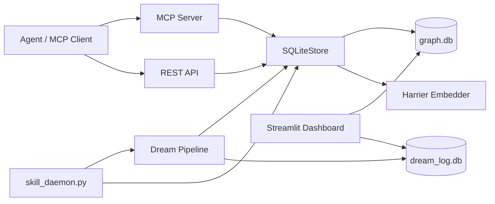
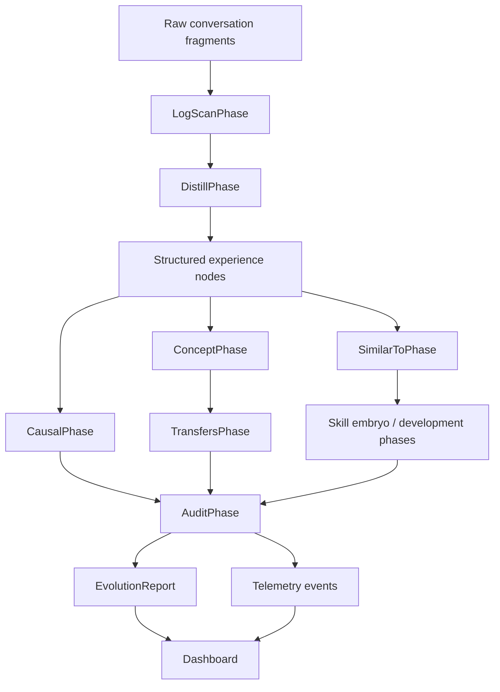
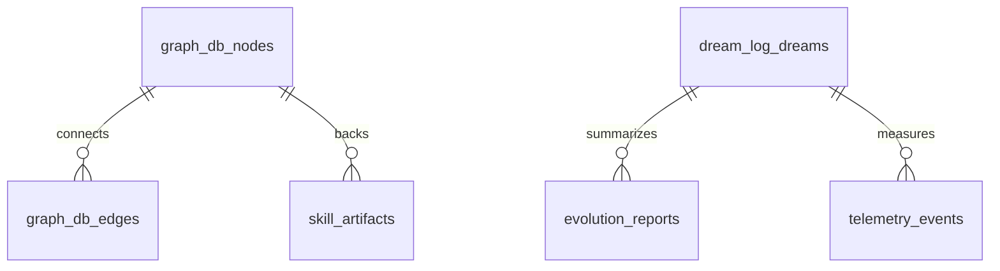

# Mnemosyne Architecture

Mnemosyne is a local-first memory graph for AI agents. The system turns raw interaction fragments into structured memories, graph edges, skills, reports, and active hot-memory context.

## Runtime Map



## Data Flow



## Core Components

- `scripts/core/sqlite_store.py`: storage boundary for nodes, edges, search, skill artifacts, and field contract enforcement.
- `scripts/core/contracts.py`: shared serialization/deserialization contract for node JSON fields and query responses.
- `scripts/core/dream_pipeline.py`: phase orchestration, dream logging, EvolutionReport generation, and telemetry persistence.
- `scripts/mcp_server/__init__.py`: MCP tools for memory write/search/detail/update and skill feedback.
- `scripts/api/start_api.py`: REST surface for memory operations, reports, and telemetry.
- `scripts/skill_daemon.py`: scheduled dream + skill governance loop.
- `scripts/dashboard/`: local Streamlit dashboard for operational visibility.

## Dream Pipeline Contract

Full dream mode runs:

```text
SnapshotPhase
SimilarToPhase
LogScanPhase
DistillPhase
CausalPhase
ConceptPhase
TransfersPhase
ContradictsPhase
SkillEmbryoPhase
SkillDevelopmentPhase
SkillMirrorEvolutionPhase
StrategyPhase
CovenantPhase
DecayPhase
SyncPhase
LLMReviewPhase
AuditPhase
```

Key guarantees:

- `SnapshotPhase` captures caps for `AuditPhase` before graph mutations.
- `CausalPhase` only creates `solves` edges from structured metadata evidence.
- `ConceptPhase` creates concept nodes only from cross-task clusters.
- `TransfersPhase` derives cross-domain transfer edges from concept membership.
- `DecayPhase` does not revive cold raw nodes.
- `AuditPhase` turns graph health problems into `WARN` status.
- Every dream writes `dreams`, `evolution_reports`, and `telemetry_events` rows in `dream_log.db`.

## Persistence



- `graph.db` stores long-lived memory graph state. Do not commit it.
- `dream_log.db` stores operational dream history, reports, and telemetry. Do not commit it.
- `hot/memory.md` is generated by `SyncPhase` from hot nodes.
- `skills/skill-embryo*/` are generated skill artifacts and should not be committed unless explicitly reviewed.

## Testing Boundaries

- `tests/test_dream_phase_contract.py` locks deterministic behavior for high-risk Dream phases.
- `scripts/test_mcp_memory_write_fields.py` locks MCP field round-trip behavior.
- `scripts/test_contract_roundtrip.py` locks MCP/REST/store edge/search contract behavior.
- `scripts/test_dream_reporting_contract.py` locks EvolutionReport and telemetry persistence behavior.

## Contributor Rules

- Add new node fields through `scripts/core/contracts.py` first, then wire MCP, REST, Store, and tests.
- Do not write raw SQL outside Store unless the operation is explicitly operational logging or migration.
- Do not promote skills based only on dry-run score; approval needs real evidence.
- Keep reports and telemetry structured JSON first; LLM prose can be added later as an optional view.
